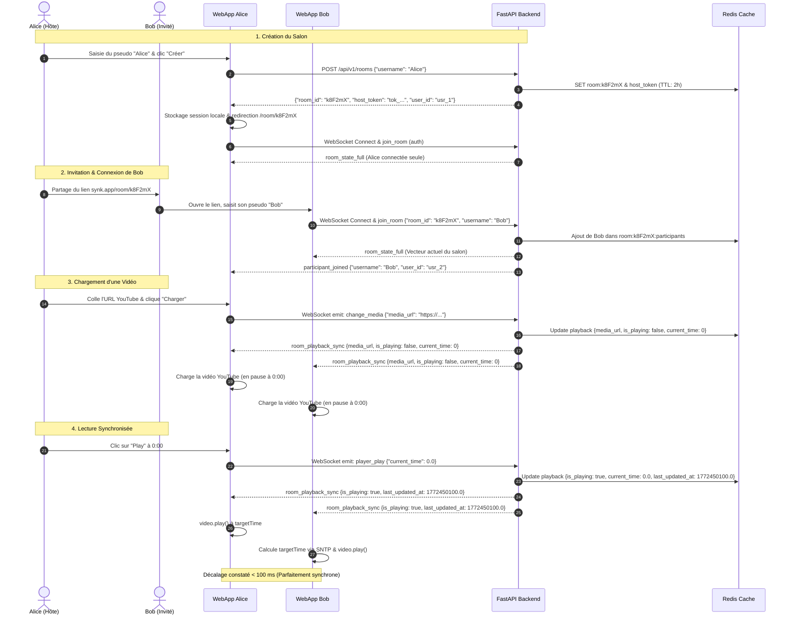

# Algorithme de Synchronisation Temps Réel — SYNK

> **Document Version :** 1.0.0-beta  
> **Composant Critique :** Moteur de lecture distribué & Recalage temporel

---

## 1. Principes Fondamentaux & Modèle d'Autorité

La synchronisation repose sur une architecture client-serveur événementielle où le serveur backend et l'hôte du salon constituent l'autorité de vérité.

### 1.1. Qui est le Maître (Host) ?
* **Créateur initial :** Le premier utilisateur qui crée le salon via `POST /api/v1/rooms` reçoit un jeton secret (`host_token`).
* **Verrouillage de la salle (`is_locked`) :**
  * `is_locked = true` (**Mode Hôte exclusif**) : Seul l'hôte a le droit d'envoyer les ordres `player_play`, `player_pause`, `player_seek` et `change_media`. Les tentatives des invités sont interceptées côté client et rejetées côté serveur.
  * `is_locked = false` (**Mode Libre**) : Tous les participants peuvent contrôler le lecteur (principe du *Last-Write-Wins* via l'horodatage serveur).
* **Élection / Transfert d'Hôte :** Si l'hôte quitte le salon ou ferme son navigateur, le backend détecte la déconnexion WebSocket et transfère automatiquement le rôle d'hôte au participant connecté depuis le plus longtemps.

---

## 2. Algorithme d'Extrapolation Temporelle

Pour minimiser l'empreinte réseau et éliminer le jitter, le serveur n'émet **pas** de flux continu de position temporelle. Il enregistre un **vecteur cinématique** lors de chaque transition d'état.

### 2.1. Vecteur d'État dans Redis
Lorsqu'une action de lecture intervient, le serveur enregistre :
* `current_time` : La position de lecture au moment de l'événement (en secondes).
* `is_playing` : L'état booléen du lecteur (en lecture ou en pause).
* `last_updated_at` : L'horodatage précis du serveur Unix en secondes avec millisecondes (`time.time()`).

### 2.2. Calcul du Temps de Référence Côté Client
Chaque client calcule en continu la position théorique exacte du salon grâce à la fonction canonique [`calculateReferenceTime`](file:///home/mohamed/M2DATA/Synk/front/src/lib/utils.ts#L28) :

$$\text{nowServer} = \text{Date.now()} + \text{serverTimeOffsetMs}$$

$$\text{roomTime} = \begin{cases} 
\text{current\_time} & \text{si } \text{is\_playing} = \text{false} \\ 
\min(\text{current\_time} + \frac{\text{nowServer} - \text{last\_updated\_at}}{1000}, \text{duration}) & \text{si } \text{is\_playing} = \text{true} 
\end{cases}$$

---

## 3. Compensation de la Latence et du Décalage d'Horloge (SNTP)

Le décalage de l'horloge système du client (*Clock Skew*) peut induire des erreurs d'extrapolation massives si le PC du client retarde ou avance de quelques secondes par rapport au serveur.

### 3.1. Formule SNTP (RFC 4330)
Lors de l'échange de paquets ping/pong WebSocket :
1. Le client envoie une requête ping avec son timestamp local $T_0$.
2. Le serveur répond immédiatement avec son timestamp serveur $T_{\text{server}}$.
3. Le client reçoit la réponse à $T_1$. Le temps de trajet aller-retour est :
   $$\text{RTT} = T_1 - T_0$$
4. Le décalage d'horloge serveur est estimé par :
   $$\text{serverTimeOffsetMs} = T_{\text{server}} - \left(T_0 + \frac{\text{RTT}}{2}\right)$$

Ce décalage est injecté dans tous les calculs d'extrapolation temporelle, garantissant une cohérence absolue même si la machine de l'utilisateur a une heure locale incorrecte.

---

## 4. Seuils de Recalage & Gestion de la Dérive (Drift Thresholds)

Pour éviter les saccades audio insupportables tout en maintenant une synchronisation stricte, le lecteur applique une politique à trois paliers :

```text
               0.5s                           2.0s
────────────────┼──────────────────────────────┼────────────────────────► (Écart temporel)
  ZONE VERTE    │         ZONE JAUNE           │        ZONE ROUGE
  Lecture douce │    Recalage DOM forcé        │    Bouton "Rattraper"
  (Aucun saut)  │ (video.currentTime = target) │    (Action manuelle)
```

1. **Écart < 0.5s (`DOM_SYNC_DRIFT_THRESHOLD_SECONDS`) :**
   * Tolérance normale absorbant les micro-variations de buffer réseau.
   * La balise vidéo joue sans aucune interruption.
2. **Écart entre 0.5s et 2.0s :**
   * Recalage impératif discret : `video.currentTime = target`.
   * Un verrou temporel de 300 ms (`SEEK_LOCK_DURATION_MS`) bloque les événements parasites de feedback en boucle.
3. **Écart > 2.0s (`DESYNC_THRESHOLD_SECONDS`) :**
   * L'utilisateur a subi un re-buffering sévère ou a mis l'onglet en veille prolongée.
   * Le badge dynamique **« Rattraper »** s'affiche en cyan pulsé au-dessus de la timeline pour permettre un recalage immédiat en un clic.

### 4.2. Gestion du Multitâche (Page Visibility API)
Lorsque l'utilisateur quitte l'onglet du salon, les navigateurs modernes ralentissent l'exécution des boucles JavaScript (`requestAnimationFrame` / `setInterval`).
Dès que l'utilisateur revient sur l'onglet (`visibilitychange` vers `visible`), le hook [`usePlayer`](file:///home/mohamed/M2DATA/Synk/front/src/hooks/usePlayer.ts#L227) recalcule instantanément le temps de référence et recale le lecteur si l'écart dépasse 0.5s.

---

## 5. Diagramme de Séquence Complet : Du Salon à la Lecture

Ce diagramme illustre le cycle complet de création, de raccordement invité et de lecture synchronisée :


