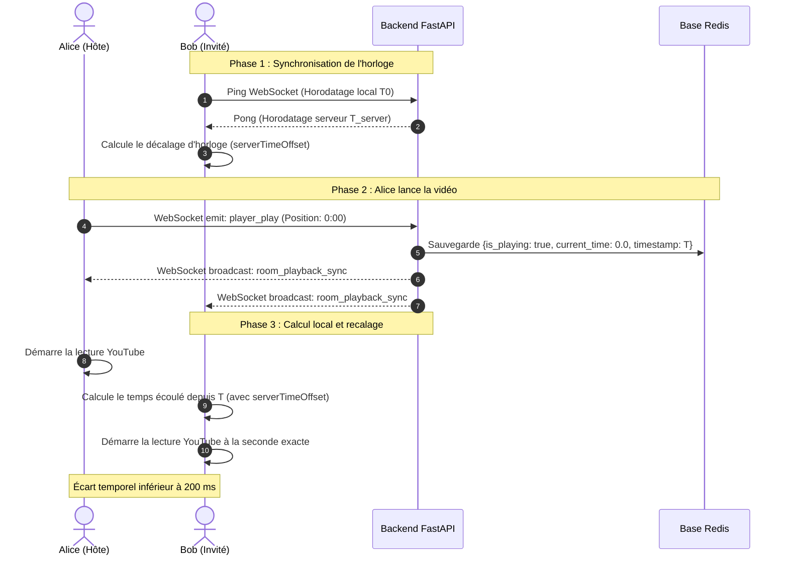

# Synchronisation Temps Réel : SYNK

> **Version :** 1.0.0-beta  
> **Composant :** Moteur de lecture et recalage temporel  
> **Auteur :** Mohmo

---

## Le Fil Conducteur : L'Histoire d'Alice et Bob

Pour comprendre le fonctionnement de l'algorithme, suivons deux amis : **Alice** (l'hôte, à Paris) et **Bob** (l'invité, à Montréal) qui veulent regarder une vidéo YouTube ensemble.

---

### Étape 1 : Pourquoi ne pas simplement "diffuser" la vidéo ?

Si le serveur devait capturer et retransmettre l'image vidéo à Bob en continu (comme un partage d'écran Discord), cela demanderait une bande passante énorme et une lourde carte graphique côté serveur.

**Le choix SYNK :**  
Chaque navigateur charge directement la vidéo depuis YouTube. Le serveur FastAPI ne transmet aucune image : il agit uniquement comme un **arbitre temporel ultra-léger** qui donne le tempo via WebSockets.

---

### Étape 2 : La synchronisation des montres (Le problème du décalage d'horloge)

Avant même de lancer la vidéo, un premier piège se pose :
> Si l'ordinateur de Bob retarde de 2 secondes par rapport à l'heure universelle, tous ses calculs de temps auront 2 secondes de retard.

**La solution :**
1. Le navigateur de Bob envoie régulièrement un ping WebSocket au backend FastAPI.
2. FastAPI répond immédiatement avec son heure serveur exacte.
3. Le navigateur de Bob calcule le temps de trajet aller-retour et en déduit son écart d'horloge (`serverTimeOffset`).
4. **Résultat :** Le navigateur de Bob sait exactement combien de millisecondes ajouter ou soustraire pour être à la même seconde que le serveur, peu importe les réglages de son PC.

---

### Étape 3 : Alice clique sur "Play" (La persistance dans Redis)

Alice clique sur le bouton **Play** à la seconde `0:00` de la vidéo.

1. Le navigateur d'Alice émet l'événement `player_play` vers FastAPI via WebSocket.
2. FastAPI valide que le salon n'est pas verrouillé et enregistre instantanément l'état dans Redis :
   * `current_time : 0.0` (la seconde de départ)
   * `is_playing : true` (l'état de lecture)
   * `last_updated_at : 1772450100.0` (l'heure exacte du clic sur le serveur)
3. FastAPI diffuse immédiatement cet événement (`room_playback_sync`) à tous les participants connectés via WebSocket.

---

### Étape 4 : Le calcul instantané chez Bob

Dès réception du message, le navigateur de Bob ne demande pas au serveur "Où en est la vidéo ?". Il applique une formule simple :

$$\text{Position cible} = \text{current\_time} + (\text{Heure actuelle du serveur} - \text{last\_updated\_at})$$

Même si le message a mis 40 millisecondes à traverser l'Atlantique, Bob sait que la vidéo tourne déjà depuis 40 millisecondes. Son lecteur se cale directement à `0.04s` et lance la lecture. Les deux vidéos jouent en parfaite synchronisation (< 200 ms d'écart).

---

### Étape 5 : Les aléas du direct (La gestion de la dérive)

Pendant le film, le Wi-Fi de Bob a une baisse de débit, ou Bob change d'onglet pour répondre à un message. Sa vidéo prend du retard par rapport au temps de référence calculé.

Synk applique alors une politique à trois seuils pour éviter les coupures de son intempestives :

```text
               0.5s                           2.0s
────────────────┼──────────────────────────────┼────────────────────────► (Écart constaté)
   ZONE VERTE   │         ZONE JAUNE           │        ZONE ROUGE
  Lecture douce │      Recalage discret        │    Bouton "Rattraper"
  (Aucun saut)  │ (video.currentTime = target) │    (Action manuelle)
```

1. **Écart inférieur à 0.5s (Zone verte) :**
   * Tolérance normale absorbant les micro-variations de buffer.
   * On ne touche à rien pour préserver la fluidité du son.
2. **Écart entre 0.5s et 2.0s (Zone jaune) :**
   * Le retard devient perceptible.
   * Le lecteur force discrètement le recalage (`video.currentTime = target`) sans interrompre la lecture.
3. **Écart supérieur à 2.0s (Zone rouge) :**
   * L'ordinateur de Bob a subi un gros gel réseau ou a mis l'onglet en veille.
   * Un badge cyan **"Rattraper"** apparaît au-dessus de la barre de lecture. Bob clique dessus pour se recaler instantanément.

---

## Schéma Technique Complet

Ce diagramme illustre le flux complet des données entre les navigateurs clients, le backend FastAPI et la base en mémoire Redis :


