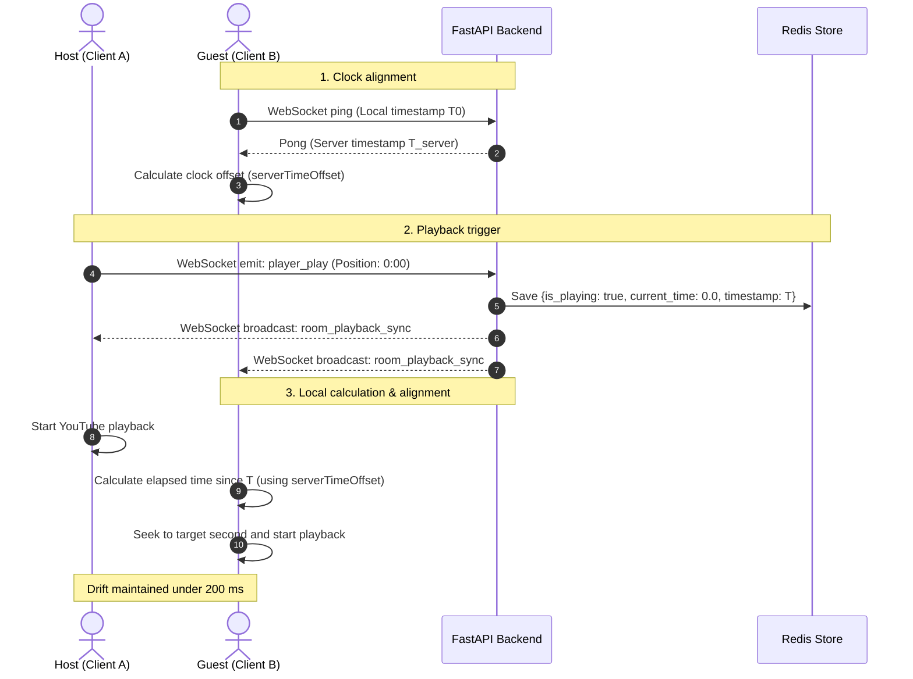

# Real-Time Synchronization : SYNK

> **Version:** 1.0.0-beta  
> **Component:** Playback engine and clock drift compensation  
> **Author:** Mohmo

---

## 1. Core Principle: Decentralized Playback

Streaming video frames continuously from the server (like a Discord screen share) would demand massive network bandwidth and overload backend servers.

**The SYNK Approach:**
* Each client loads and plays the video directly from the source (YouTube).
* The FastAPI backend transmits zero video frames: it acts purely as a **lightweight time referee** that synchronizes playback state over WebSockets.

---

## 2. Step 1: Clock Alignment (Offset Compensation)

For two machines to calculate the exact same playback second, they must share a common time reference. If a user's system clock is 2 seconds behind, their playback calculation will be wrong by 2 seconds.

**Offset Compensation Mechanism:**
1. The browser regularly sends a WebSocket ping to the backend.
2. The server immediately replies with its exact timestamp.
3. The browser measures round-trip network time and calculates its local clock offset (`serverTimeOffset`).
4. **Result:** The client knows precisely how many milliseconds to add or subtract to match the server clock, regardless of the user's local operating system settings.

---

## 3. Step 2: Play Trigger & Redis Persistence

When an authorized user clicks **Play** (for example, at second `0:00`):

1. The client emits the WebSocket event `player_play` to FastAPI.
2. FastAPI validates room permissions (host-locked vs. free mode) and writes the state to Redis:
   * `current_time: 0.0` (starting position)
   * `is_playing: true` (playback status)
   * `last_updated_at: 1772450100.0` (exact server timestamp of the action)
3. FastAPI immediately broadcasts this event (`room_playback_sync`) to all room participants.

---

## 4. Step 3: Client-Side Position Calculation

Upon receiving the playback notification, each guest browser calculates the target position instantly:

> **Target Position** = `current_time` + (`Current Server Time` - `last_updated_at`)

Even if the network packet took 40 milliseconds to travel across the internet, the guest knows the video has already been playing for 40 ms. The player immediately seeks to `0.04s` and starts playing.

---

## 5. Step 4: Network Drift Handling (3 Thresholds)

During a watch session, network fluctuations or background tab throttling can cause local video playback to drift away from the reference time.

To avoid stuttering audio from continuous seeking, the player applies a 3-tier correction policy:

```text
               0.5s                           2.0s
────────────────┼──────────────────────────────┼────────────────────────► (Detected Drift)
   GREEN ZONE   │         YELLOW ZONE          │        RED ZONE
  Smooth Play   │         Quiet Seek           │    "Catch Up" Button
  (Zero seek)   │ (video.currentTime = target) │    (Manual action)
```

1. **Drift under 0.5s (Green Zone):**
   * Normal imperceptible buffer variation.
   * No seek is triggered to keep sound smooth and uninterrupted.
2. **Drift between 0.5s and 2.0s (Yellow Zone):**
   * Moderate noticeable desync.
   * The player quietly realigns the video element (`video.currentTime = target`) without stopping playback.
3. **Drift over 2.0s (Red Zone):**
   * Severe lag from a network drop or a sleeping background tab.
   * A cyan **"Catch Up"** button appears over the timeline, allowing the user to realign in one click.

---

## 6. Technical Sequence Diagram


