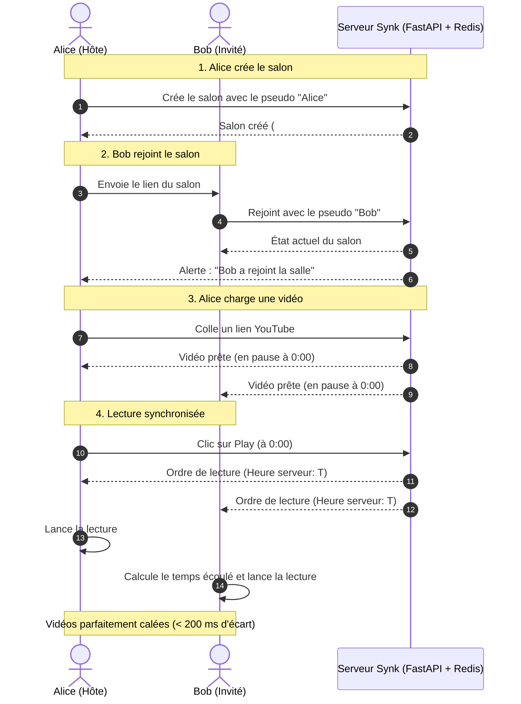

# Synchronisation Temps Réel : SYNK

> **Version :** 1.0.0-beta  
> **Composant :** Moteur de lecture et recalage temporel  
> **Auteur :** Mohmo

---

## 1. Le Principe en une phrase

Pour ne pas saturer la connexion internet, **le serveur n'envoie pas la position de la vidéo en continu**. 

Il envoie un message uniquement lorsqu'un bouton est cliqué (*Play*, *Pause*, *Avance rapide*), avec l'heure exacte de l'action. Chaque navigateur calcule ensuite lui-même où doit se trouver la vidéo.

---

## 2. Le Calcul de la Position

Quand un événement arrive, le serveur retient trois informations :
* `current_time` : La seconde où se trouve la vidéo (ex: 42.5s).
* `is_playing` : Si la vidéo est en lecture ou en pause (`true` ou `false`).
* `last_updated_at` : L'heure exacte du serveur au moment du clic.

Chaque navigateur calcule alors la position en direct :
* **Si la vidéo est en pause :** Tout le monde reste calé sur `current_time`.
* **Si la vidéo est en lecture :**  
  `Position = current_time + (Heure actuelle - Heure du clic Play)`

---

## 3. Le Piège des Horloges Décalées (et sa solution)

Si l'ordinateur d'un participant retarde de 3 secondes par rapport à l'heure réelle, son calcul de position sera faux de 3 secondes.

**Comment Synk corrige cela :**
1. Le navigateur envoie un ping régulier au serveur.
2. Le serveur répond avec son heure précise.
3. Le navigateur mesure le temps de trajet aller-retour et calcule son décalage par rapport au serveur (`serverTimeOffset`).
4. Ce décalage est appliqué à tous les calculs : même si l'ordinateur de l'utilisateur a une heure locale complètement fausse, la vidéo reste parfaitement calée sur celle des autres.

---

## 4. Les 3 Seuils de Recalage

Modifier la position d'une vidéo en continu produit un son haché et désagréable. Pour préserver le confort d'écoute, Synk applique trois zones de tolérance :

```text
               0.5s                           2.0s
────────────────┼──────────────────────────────┼────────────────────────► (Écart constaté)
   ZONE VERTE   │         ZONE JAUNE           │        ZONE ROUGE
  Lecture douce │      Recalage discret        │    Bouton "Rattraper"
  (Aucun saut)  │ (Alignement automatique)     │    (Action manuelle)
```

1. **Écart inférieur à 0.5s (Zone verte) :**
   * Différence invisible à l'œil et à l'oreille.
   * On ne touche à rien pour ne pas couper le son.
2. **Écart entre 0.5s et 2.0s (Zone jaune) :**
   * Petit retard de connexion.
   * Le lecteur saute discrètement à la bonne seconde pour recoller au groupe.
3. **Écart supérieur à 2.0s (Zone rouge) :**
   * Gros ralentissement réseau ou onglet mis en veille prolongée par le système.
   * Un bouton **"Rattraper"** apparaît au-dessus de la barre de lecture pour se remettre à niveau en un clic.

---

## 5. Retour sur l'Onglet (Mise en veille)

Lorsque l'utilisateur change d'onglet, le navigateur ralentit automatiquement la page pour économiser la batterie.

Dès que l'utilisateur revient sur Synk, l'application détecte le retour au premier plan, recalcule immédiatement l'écart avec le serveur et recale la vidéo si elle a pris du retard.

---

## 6. Déroulement Complet (Création, Connexion et Lecture)


