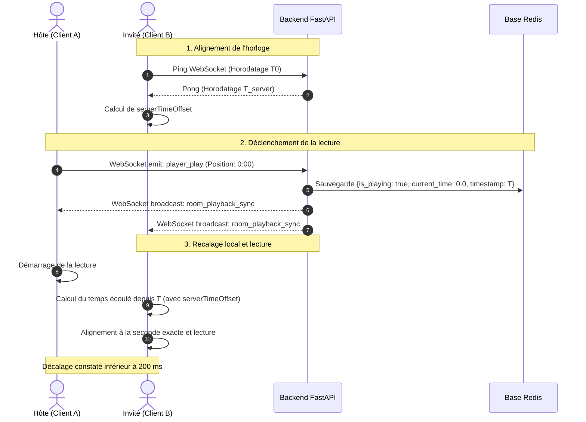

# Synchronisation Temps Réel : SYNK

> **Version :** 1.0.0-beta  
> **Composant :** Moteur de lecture et recalage temporel  
> **Auteur :** Mohmo

---

## 1. Principe Fondamental : Décentraliser la Lecture

Retransmettre le flux vidéo en continu depuis le serveur (comme un partage d'écran) exigerait une bande passante considérable et saturerait l'infrastructure.

**L'approche SYNK :**
* Chaque client charge et lit le média directement à la source (YouTube).
* Le backend FastAPI n'achemine aucune image : il agit comme un **arbitre temporel léger** qui synchronise l'état de lecture via WebSocket.

---

## 2. Étape 1 : Alignement des Horloges (Compensation du Décalage)

Pour que deux machines calculent exactement la même seconde de lecture, elles doivent partager une référence temporelle commune. Si l'horloge système d'un utilisateur retarde de 2 secondes, son calcul sera faussé.

**Mécanisme de compensation :**
1. Le navigateur émet régulièrement un ping WebSocket vers le backend.
2. Le serveur répond immédiatement avec son horodatage précis (heure du serveur).
3. Le navigateur mesure le temps d'aller-retour réseau et en déduit son écart d'horloge (`serverTimeOffset`).
4. **Résultat :** Le client sait exactement combien de millisecondes ajouter ou soustraire pour s'aligner sur l'heure du serveur.

---

## 3. Étape 2 : Déclenchement de la Lecture & Persistance Redis

Lorsqu'un utilisateur autorisé clique sur **Play** (par exemple à la seconde `0:00`) :

1. Le client émet l'événement WebSocket `player_play` vers FastAPI.
2. FastAPI valide les permissions (mode de contrôle de la salle) et enregistre l'état dans Redis :
   * `current_time : 0.0` (position de départ)
   * `is_playing : true` (état de lecture)
   * `last_updated_at : 1772450100.0` (horodatage serveur de l'action)
3. FastAPI diffuse immédiatement cet événement (`room_playback_sync`) à tous les participants du salon.

---

## 4. Étape 3 : Calcul de la Position Côté Client

Dès réception de la notification de lecture, chaque navigateur invité calcule instantanément la position cible :

> **Position cible** = `current_time` + (`Heure serveur actuelle` - `last_updated_at`)

Même si le message a mis 40 millisecondes à transiter sur le réseau, l'invité sait que la vidéo a démarré depuis 40 ms. Son lecteur s'aligne immédiatement à `0.04s` et lance la lecture.

---

## 5. Étape 4 : Gestion de la Dérive Réseau (Politique des 3 Seuils)

Pendant le visionnage, des variations de débit réseau ou la mise en veille d'un onglet peuvent créer un décalage entre la vidéo locale et la position de référence.

Pour éviter les coupures audio saccadées, le lecteur applique trois paliers de correction :

```text
               0.5s                           2.0s
────────────────┼──────────────────────────────┼────────────────────────► (Écart constaté)
   ZONE VERTE   │         ZONE JAUNE           │        ZONE ROUGE
  Lecture douce │      Recalage discret        │    Bouton "Rattraper"
  (Aucun saut)  │ (video.currentTime = target) │    (Action manuelle)
```

1. **Écart inférieur à 0.5s (Zone verte) :**
   * Tolérance normale absorbant les micro-variations de buffer.
   * La vidéo continue de jouer sans saut pour préserver le confort d'écoute.
2. **Écart entre 0.5s et 2.0s (Zone jaune) :**
   * Décalage modéré perceptible.
   * Le lecteur force discrètement le réalignement (`video.currentTime = target`) sans interrompre la lecture.
3. **Écart supérieur à 2.0s (Zone rouge) :**
   * Retard important suite à un gel de connexion ou une veille prolongée de l'onglet.
   * Un bouton contextuel **"Rattraper"** apparaît pour permettre à l'utilisateur de se recaler d'un clic.

---

## 6. Diagramme de Séquence Technique


