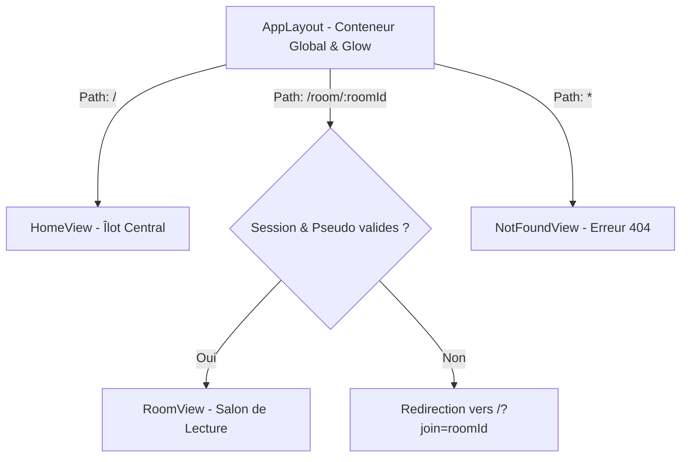

# Architecture Frontend : SYNK

> **Version :** 1.0.0-beta  
> **Framework :** React 18.3 + TypeScript 5.7 + Vite 6.2  
> **Auteur :** Mohmo

---

## 1. Arborescence du Code Source (`front/src`)

L'architecture est découpée selon les responsabilités techniques et métier (Séparation des Préoccupations / SRP) :

```text
front/src/
├── components/           # Composants réutilisables transverses
│   ├── ui/               # Primitives Radix UI stylisées (Button, Sheet, Dialog, Slider, Tabs...)
│   ├── shared/           # Composants partagés métier (AmbientGlow, Omnibox, PlatformBadges)
│   ├── LeftSidebar.tsx   # Navigation latérale gauche repliable
│   ├── RightSidebar.tsx  # Volet contextuel droit (membres, chat, slot de portail)
│   ├── SidebarSettings.tsx # Pied de page de préférences (langue, statut)
│   └── SynkIcon.tsx      # Emblème SVG officiel
│
├── views/                # Vues applicatives (Pages routées)
│   ├── home/             # Écran d'atterrissage (Îlot central, création & jointure)
│   ├── room/             # Salon de synchronisation vidéo (Lecteur, Chat, Contrôles)
│   └── notFound/         # Écran d'erreur 404 / salon expiré
│
├── layouts/              # Gabarits structurels
│   └── AppLayout.tsx     # Layout racine : Mur noir, lueur d'ambiance, canvas central
│
├── hooks/                # Logique métier et orchestrateurs sous forme de hooks
│   ├── useHome.ts        # Gestion du formulaire de l'accueil et validation
│   ├── useRoom.ts        # Hook maître orchestrant le WebSocket et l'état du salon
│   ├── useRoomSocket.ts  # Couche transport Socket.IO bas niveau et heartbeat
│   ├── usePlayer.ts      # Machine d'état et recalage temporel du lecteur multimédia
│   ├── useCinemaMode.ts  # Gestion du plein écran et disparition des contrôles
│   └── usePlayerShortcuts.ts # Raccourcis clavier universels (Space, K, F, M, Arrow...)
│
├── stores/               # État global léger (Zustand)
│   └── uiStore.ts        # État UI transverse (barre latérale repliée, tiroirs mobiles)
│
├── services/             # Clients de communication externe
│   ├── APIClient.ts      # Instance Axios normalisée avec mapping d'erreurs
│   └── roomApi.ts        # Endpoints REST du salon (checkRoom, createRoom)
│
├── lib/                  # Utilitaires purs et helpers
│   ├── constants.ts      # Seuils de synchronisation temporelle (DESYNC_THRESHOLD, etc.)
│   ├── utils.ts          # Calculs de temps de référence, formatage, classes Tailwind (cn)
│   ├── validation.ts     # Validations regex (pseudo, code salon)
│   ├── session.ts        # Persistance locale sécurisée des identifiants (sessionManager)
│   └── errorMapper.ts    # Traduction des codes d'erreur API en messages utilisateurs
│
├── types/                # Déclarations et types TypeScript stricts
│   ├── room.ts           # Modèles Participant, RoomState, RoomSettings
│   ├── player.ts         # Machine d'état du lecteur (PlaybackStatus, PlayerState)
│   └── events.ts         # Schémas des événements WebSocket
│
└── i18n/                 # Internationalisation (i18next)
    ├── locales/fr/       # Dictionnaires français (global, room, validation, errors)
    └── locales/en/       # Dictionnaires anglais
```

---

## 2. Stratégie de Routage (`react-router-dom` v6)

Le routage est orchestré de manière déclarative dans [`front/src/routes.tsx`](file:///home/mohamed/M2DATA/Synk/front/src/routes.tsx) :



### Règle du Guard Synchrone (Zéro FOUC / Clignotement)
Dans `RoomView`, la session locale est analysée de façon synchrone au montage :
```tsx
const session = useMemo(() => (roomId ? sessionManager.getRoomSession(roomId) : null), [roomId]);
if (!roomId || !session?.username) {
  return <Navigate to={roomId ? `/?join=${encodeURIComponent(roomId)}` : "/"} replace />;
}
```
* **Bénéfice :** Si un utilisateur ouvre un lien direct sans pseudo, il est redirigé vers l'accueil instantanément sans aucun clignotement ni initialisation prématurée du lecteur vidéo.

---

## 3. Gestion de l'État (State Management)

SYNK applique une séparation stricte entre les trois types d'états :

### 3.1. État Global UI (Zustand : `uiStore.ts`)
Réservé exclusivement aux préférences d'interface qui persistent pendant la navigation :
* État rétracté ou déplié de la barre latérale gauche (`isSidebarCollapsed`).
* Pas de duplication d'états serveur dans Zustand.

### 3.2. État Temps Réel Distribué (Hook Orchestrateur : `useRoom.ts`)
L'état du salon (participants connectés, média en cours, horodatage, permissions) est piloté par le hook `useRoom` :
* Synchronisé directement avec les événements WebSocket Socket.IO.
* Mise à jour réactive sans re-renders inutiles grâce aux références (`useRef`) pour les valeurs hautement volatiles (timestamps de lecture).

### 3.3. État Local Volatile (`useState` / `useRef`)
* Valeurs de formulaires éphémères (`mediaUrlInput`, `mobileMenuOpen`).
* Références DOM natives pour la balise `<video>` ou l'API YouTube IFrame.
