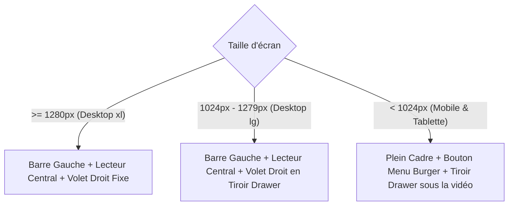

# Spécifications UI/UX & Design System : SYNK

> **Version :** 1.0.0-beta  
> **Philosophie Visuelle :** Minimalisme Mécanique  
> **Auteur :** Mohmo

---

## 1. Direction Artistique : « Minimalisme Mécanique »

La direction artistique de **SYNK** repose sur l'élimination systématique du superflu pour créer une ambiance high-tech sobre et fonctionnelle.

### 1.1. Principes Fondateurs
* **Effacement au profit du média :** L'interface doit s'estomper lorsque la vidéo joue. Zéro distraction visuelle inutile.
* **Précision chirurgicale :** Angles nets, typographies monospace pour les métriques, bordures ultra-fines (1px) semi-transparentes.
* **Pas de "Div Soup" :** Arbre DOM plat, hiérarchie visuelle gérée par les contrastes de luminosité plutôt que par une accumulation de conteneurs.

---

## 2. Palette Chromatique & Tokens de Design

L'ensemble des couleurs de SYNK est structuré autour d'une échelle sombre avec un contraste d'accentuation haute visibilité :

| Rôle | Token / Valeur CSS | Utilisation |
| :--- | :--- | :--- |
| **Noir Absolu (Mur)** | `#000000` / `bg-black` | Arrière-plan global et fond du lecteur vidéo pour immersion totale. |
| **Fond d'Application (Canvas)** | `#09090b` / `zinc-950` | Conteneur applicatif principal et tiroirs latéraux. |
| **Surfaces & Cartes** | `#18181b` / `zinc-900` | Éléments interactifs, barre latérale, modales. |
| **Bordures Subtiles** | `rgba(255, 255, 255, 0.05)` | Délimitations discrètes sans rupture brutale. |
| **Couleur Signature (Cyan)** | `#0ac8b9` (`rgba(10, 200, 185, 1)`) | Boutons d'action principaux, jauges de lecture, statut de synchro, logo. |
| **Texte Principal** | `#f4f4f5` / `zinc-100` | Titres et contenus actifs. |
| **Texte Secondaire** | `#a1a1aa` / `zinc-400` | Labels, horodatages, états inactifs. |
| **Alerte / Verrou** | `#f43f5e` / `rose-500` | Déconnexion, erreurs réseau, contrôle exclusif. |

---

## 3. Typographie

* **Interface & Titres :** `Inter` (sans-serif) : Clarté, lisibilité maximale sur tous types d'écrans.
* **Données Techniques & Métriques :** `Geist Mono` : Horodatages vidéo (`04:12 / 12:30`), codes de salon (`#k8F2mX`), latence (`24ms`).

---

## 4. Architecture de Mise en Page : « Floating Island » (Îlot Flottant)

### 4.1. Page d'Accueil (`/`) : L'Îlot Central

Sur grand écran (`>= lg`), l'application dispose d'une barre latérale gauche et d'un canvas principal sombre aux coins arrondis :

```text
+-----------------------------------------------------------------------------------------+
| BARRE GAUCHE (Desktop)   |                    CANVAS PRINCIPAL (Sombre)                 |
|                          |                                                              |
| [Logo] SYNK              |                                                              |
|                          |                     Lancer une session                       |
| NAVIGATION               |            Créez un salon instantané et synchronisez         |
| - Accueil (actif)        |                     vos vidéos en temps réel.                |
| - Récents                |                                                              |
|                          |                  [ Créer un salon | Rejoindre ]              |
|                          |                                                              |
|                          |          ┌───────────────────────────────────┬───────────┐   |
|                          |          │  Entrez votre pseudo...           │  CRÉER    │   |
|                          |          └───────────────────────────────────┴───────────┘   |
|                          |                                                              |
| PARAMÈTRES               |              [YouTube]  [Twitch: Soon]  [Direct: Soon]       |
| [FR / EN]                |                                                              |
+-----------------------------------------------------------------------------------------+
```

* **Omnibox unifiée :** Un seul champ de saisie intelligent gérant à la fois la création de salon, la validation du code d'invitation et la saisie du pseudo.
* **Transition sans saut :** Bascule instantanée entre les modes "Créer" et "Rejoindre" via un commutateur mécanique fluide (`ModeToggle`).

---

### 4.2. Salon de Visionnage (`/room/:roomId`) : Le Canvas Imbriqué

Sur grand écran (desktop `>= xl`), l'interface s'organise en trois zones :

```text
+-----------------------------------------------------------------------------------------+
| BARRE GAUCHE   |                       CANVAS VIDÉO                     | PANNEAU DROIT |
|                |                                                        |               |
| [Logo] SYNK    |  ┌──────────────────────────────────────────────────┐  | [Membres] Chat|
|                |  │                                                  │  |───────────────|
| NAVIGATION     |  │                 Lecteur Vidéo 16:9               │  | Membres (2)   |
| - Accueil      |  │                (ou Dropzone si vide)             │  | - Alice (Hôte)|
| - Récents      |  │                                                  │  | - Bob         |
|                |  │ [Play] [04:12 / 10:00] [─────|─────] [Vol] [Max] │  |               |
|                |  └──────────────────────────────────────────────────┘  |               |
|                |                                                        |               |
|                |  Point Vert LIVE  Titre de la vidéo    [CONTRÔLE HÔTE] │───────────────|
|                |  ────────────────────────────────────────────────────  | Wifi 18ms     |
| PARAMÈTRES     |  [RÉGLAGES]  File d'attente (Soon)                     | #k8F2mX       |
| [FR / EN]      |  Option de verrouillage de la salle                    | [ Inviter ]   |
+-----------------------------------------------------------------------------------------+
```

* **Lecteur 16:9 Cinématographique :** Le conteneur vidéo préserve strictement son ratio pour éviter tout décalage visuel (CLS = 0).
* **Contrôles Overlay Flottants :** La barre de transport (play/pause, timeline, volume) s'affiche en transparence sur la vidéo et s'efface automatiquement après 3 secondes d'inactivité en lecture.
* **Sous le lecteur (`MetaSection`) :** Statut de connexion en direct, titre de la vidéo, badge de contrôle de la salle et onglets de réglages.
* **Volet Droit Contextuel (`SidePanel`) :** Onglet "Membres" actif avec les participants connectés, onglet "Chat" (bientôt disponible), et carte en bas avec indicateur de latence (ping) et bouton d'invitation.

---

## 5. Stratégie Responsive (Mobile-First)

L'expérience s'adapte automatiquement selon la largeur de l'écran :



* **Écrans mobiles et tablettes (< 1024px) :**
  * La barre latérale gauche disparaît au profit d'un bouton burger discret en haut à gauche qui ouvre un tiroir coulissant (`Sheet`).
  * Le panneau latéral droit (membres et carte salon) est accessible via un bouton dédié sous la vidéo ouvrant un tiroir inférieur (`Drawer`).
  * Les réglages fins de volume sont masqués sur mobile pour laisser place aux boutons physiques de l'appareil.
