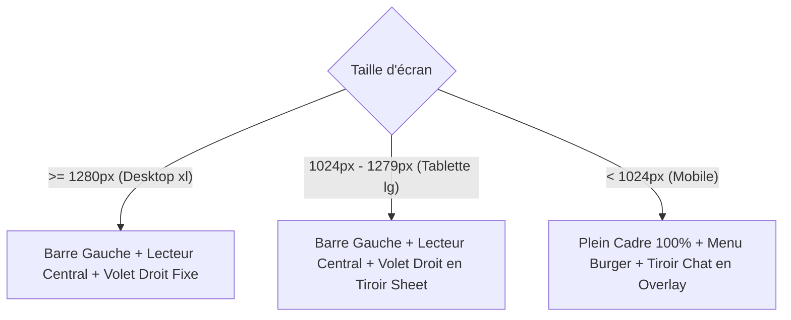

# Spécifications UI/UX & Design System — SYNK

> **Document Version :** 1.0.0-beta  
> **Philosophie Visuelle :** Minimalisme Mécanique (*Cyber-Industrial Dark*)

---

## 1. Direction Artistique : « Minimalisme Mécanique »

La direction artistique de **SYNK** repose sur l'élimination systématique du superflu pour créer une ambiance high-tech sobre et fonctionnelle.

### 1.1. Principes Fondateurs
* **Effacement au profit du média :** L'interface doit s'estomper lorsque la vidéo joue. Zéro distraction visuelle inutile.
* **Précision chirurgicale :** Angles nets, typographies monospace pour les métriques, bordures ultra-fines (1px) semi-transparentes.
* **Pas de "Div Soup" :** Arbre DOM plat, hiérarchie visuelle gérée par les contrastes de luminosité plutôt que par une accumulation de conteneurs.

---

## 2. Palette Chromatique & Tokens de Design

L'ensemble des couleurs de SYNK est structuré autour d'une échelle sombre avec un contraste d'accentuation haute visibilité :

| Rôle | Token / Valeur CSS | Utilisation |
| :--- | :--- | :--- |
| **Noir Absolu (Mur)** | `#000000` / `bg-black` | Arrière-plan global et fond du lecteur vidéo pour immersion totale. |
| **Fond d'Application (Canvas)** | `#09090b` / `zinc-950` | Conteneur applicatif principal et tiroirs latéraux. |
| **Surfaces & Cartes** | `#18181b` / `zinc-900` | Éléments interactifs, barre latérale, modales. |
| **Bordures Subtiles** | `rgba(255, 255, 255, 0.05)` | Délimitations discrètes sans rupture brutale. |
| **Couleur Signature (Cyan)** | `#0ac8b9` (`rgba(10, 200, 185, 1)`) | Boutons d'action principaux, jauges de lecture, statut de synchro, logo. |
| **Texte Principal** | `#f4f4f5` / `zinc-100` | Titres et contenus actifs. |
| **Texte Secondaire** | `#a1a1aa` / `zinc-400` | Labels, horodatages, états inactifs. |
| **Alerte / Verrou** | `#f43f5e` / `rose-500` | Déconnexion, erreurs réseau, contrôle exclusif. |

---

## 3. Typographie

* **Interface & Titres :** `Inter` (sans-serif) — Clarté, lisibilité maximale sur tous types d'écrans.
* **Données Techniques & Métriques :** `Geist Mono` — Horodatages vidéo (`04:12 / 12:30`), codes de salon (`#k8F2mX`), latence (`24ms`).

---

## 4. Architecture de Mise en Page : « Floating Island » (Îlot Flottant)

### 4.1. Page d'Accueil (`/`) : L'Îlot Central
Sur l'écran d'accueil, l'attention est focalisée sur un module unique surélevé au centre de l'écran :

```text
+-----------------------------------------------------------------------+
|  SYNK [v1.0.0]                                           [GitHub ↗]   |
|                                                                       |
|                     ┌───────────────────────────┐                     |
|                     │     Lancer une session    │                     |
|                     │  Synchronisez vos vidéos  │                     |
|                     │    en temps réel.         │                     |
|                     └─────────────┬─────────────┘                     |
|                                   │                                   |
|                      [ Créer un salon | Rejoindre ]                   |
|                                   │                                   |
|                     ┌───────────────────────────┐                     |
|                     │ [ Entrez votre pseudo... ]│ [ CRÉER ]           |
|                     └───────────────────────────┘                     |
|                                                                       |
|               YOUTUBE  /  TWITCH  /  VIMEO  /  DIRECT HLS             |
+-----------------------------------------------------------------------+
```

* **Omnibox unifiée :** Un seul champ de saisie intelligent gérant à la fois la création de salon, la validation du code d'invitation et la saisie du pseudo.
* **Transition sans saut :** Bascule instantanée entre les modes « Créer » et « Rejoindre » via un commutateur mécanique fluide (`ModeToggle`).

---

### 4.2. Salon de Visionnage (`/room/:roomId`) : Le Canvas Imbriqué

Sur grand écran (desktop), l'interface adopte une disposition à deux colonnes asymétriques :

```text
+------------------------------------------------------------------------------------------+
| [≡] SYNK                | #k8F2mX [Copier] | Host: Alice | Ping: 18ms     |  Paramètres ⚙|
+-------------------------+-------------------------------------------------+--------------+
| [Barre Gauche Repliable]|                  CANVAS VIDÉO                   | VOLET DROIT  |
|                         |                                                 |              |
|  • Accueil              |  ┌───────────────────────────────────────────┐  |  MEMBRES (3) |
|  • Salons récents       |  │                                           │  |  • Alice 👑  |
|                         |  │             Lecteur 16:9                  │  |  • Bob       |
|                         |  │                                           │  |  • Charlie   |
|                         |  └───────────────────────────────────────────┘  |──────────────|
|                         |  [▶] [04:12 / 10:00] [───────•─────] [🔊] [⛶]   |  CHAT LIVE   |
|                         |                                                 |  Bob: Go !   |
|                         |  ─────────────────────────────────────────────  |              |
|                         |  Titre : Big Buck Bunny (YouTube)               |  [Message..] |
+-------------------------+-------------------------------------------------+--------------+
```

* **Lecteur 16:9 Cinématographique :** Le conteneur vidéo préserve strictement son ratio pour éviter tout décalage visuel (CLS = 0).
* **Contrôles Overlay Flottants :** La barre de transport (play/pause, timeline, volume) s'affiche en transparence sur la vidéo et s'efface automatiquement après 3 secondes d'inactivité en lecture.
* **Volet Droit Contextuel :** Onglets "Membres" et "Chat" ancrés à droite sur Desktop (`>= xl`).

---

## 5. Stratégie Responsive (Mobile-First)

L'expérience mobile s'adapte automatiquement sans perte de fonctionnalité :



* **Écrans mobiles (< 1024px) :**
  * La barre latérale gauche disparaît au profit d'un bouton burger flottant discret en haut à gauche.
  * Le panneau latéral droit (membres et chat) bascule dans un tiroir coulissant (`Drawer` / `Sheet`) accessible d'un tap sous le lecteur.
  * Les contrôles de volume fins sont masqués pour aérer l'interface (les utilisateurs utilisent les boutons physiques du smartphone).
